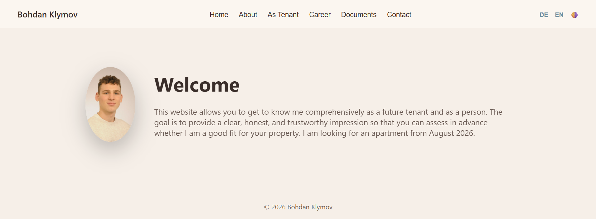
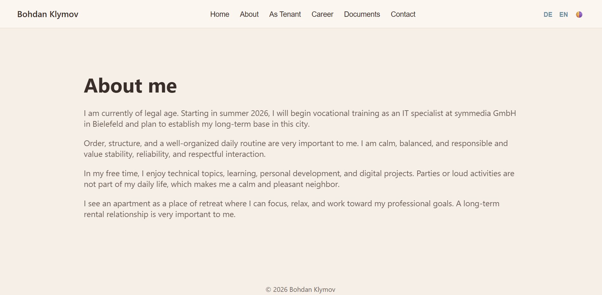
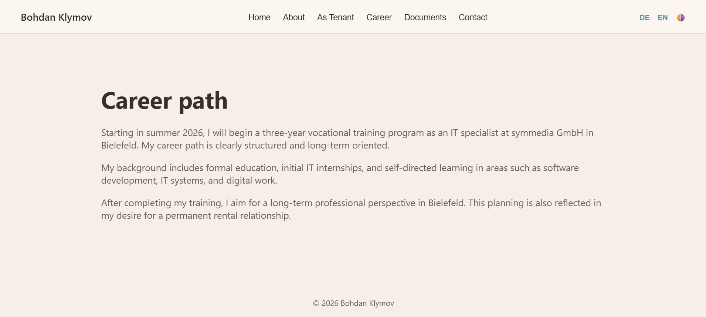
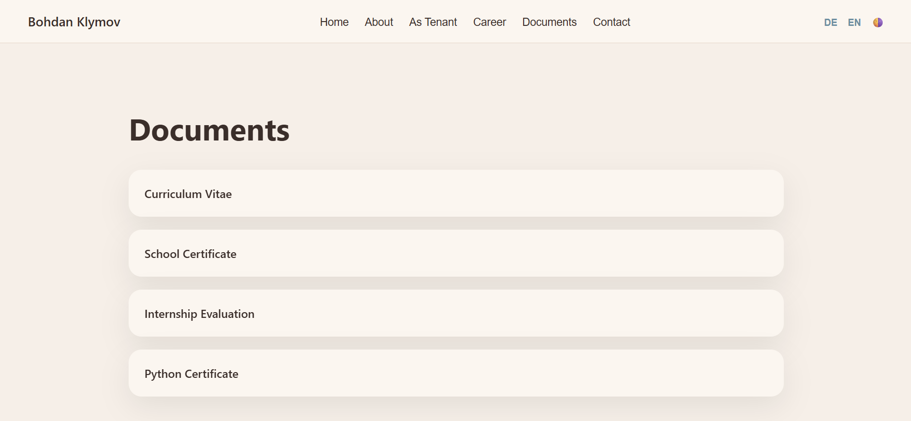
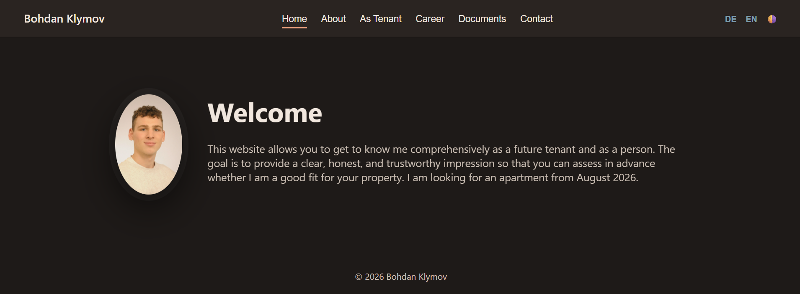

# Housing Web Portfolio

A modern, minimalistic portfolio website created to introduce myself as a reliable future tenant in Bielefeld, Germany.  
The project focuses on clarity, trust, and a calm, professional presentation tailored specifically for landlords and property managers.

The website is publicly accessible via link and designed to complement traditional rental applications with a transparent digital profile.

---

## Live Demo

🔗 **Website:**  
https://bohdan-klymov.onrender.com

---

## Screenshots







---

## About Me

Starting in summer 2026, I will begin my vocational training as a **Software Developer (Fachinformatiker für Anwendungsentwicklung)** at **symmedia GmbH** in Bielefeld, Germany.

This website was created to:

- Introduce myself beyond a standard rental application  
- Present my background, career path, and documents in a clear and structured way  
- Offer landlords a modern, transparent, and trustworthy overview of me as a future tenant  

The goal is to support long-term rental decisions by providing openness, reliability, and easy access to relevant information.

---

## Features

- Clean and modern UI designed for trust and readability  
- Tab-based navigation (content switches without long scrolling)  
- Personal profile and tenant information  
- Career path overview (education, training, self-learning)  
- Document section (CV, certificates, training contract)  
- Clickable contact links (email, phone, GitHub)  
- Multilingual support (German / English)  
- Light and dark mode with smooth transitions  
- Responsive design for desktop and mobile devices  

---

## Technologies Used

### Frontend
- HTML5  
- CSS3  
- JavaScript  

### Backend
- Python  
- Flask  

---

## Project Structure

```
HOUSING-PORTFOLIO/
├── app/
│   ├── documents/
│   ├── static/
│   │   ├── img/
│   │   ├── js/
│   │   └── css/
│   ├── templates/
│   │   ├── base.html
│   │   ├── impressunm.html
│   │   ├── index.html
│   │   └── privacy.html
│   ├── __init__.py
│   ├── routes.py
│   └── translations.py
├── screenshots
├── .gitignore
├── LICENSE
├── Procfile
├── README.md
├── requirements.txt
├── runtime.txt
└── run.py
```

---

## License

This project is personal and created for presentation purposes.
All rights reserved.
